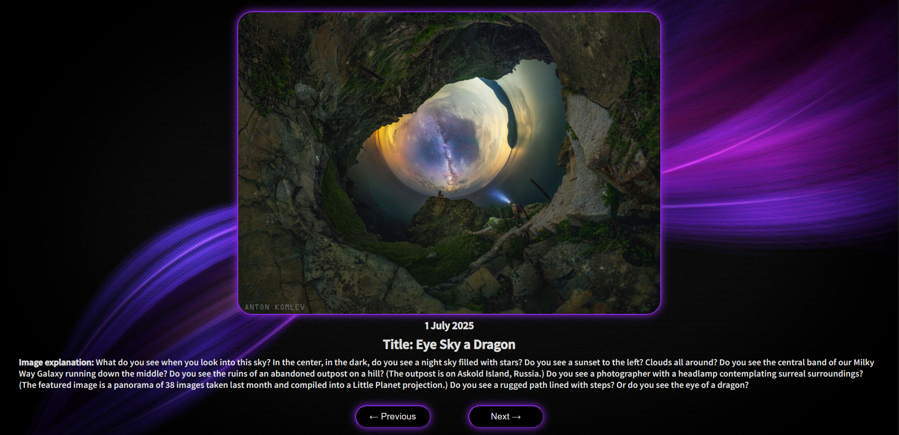

# Astronomy Picture of the Day Viewer
This is a personal project I built using Vue 3 to explore NASA’s Astronomy Picture of the Day (APOD) API. You can browse through space photos, see detailed explanations, and navigate back and forth between days.

# What it does
- Fetches NASA’s daily astronomy photo along with its title and explanation
- Shows the photo of the current day by default
- Lets you go back to see previous days pictures or forward if you’re not already viewing today’s photo
- Clicking the image opens the high-definition version so you can download or view it in full quality
- Has a clean, simple interface that works well on desktop and mobile

# Why I built it
I’m fascinated by space and love how NASA shares incredible images every day. This app was a fun way to practice Vue 3, work with APIs, and build something visually cool and educational.

## 🛠 Local Setup
1. **Clone** this repo and enter it:
  ```
  git clone https://github.com/DamianosMav/apod-viewer.git
  cd apod-viewer
  ```

2. **Install dependencies**
 ```
 npm install
 ```

3. **Create a .env file in the root folder with your NASA API key**

```
VITE_API_KEY=your_nasa_api_key_here
VITE_API_URL=https://api.nasa.gov/planetary/apod
```

(You can get one for free at the https://api.nasa.gov/)


4. **Start the dev server**
```
npm run dev
```

# What I learned / used
- Vue 3 Composition API with script setup
- Working with external APIs and handling loading states
- Managing date navigation and disabling buttons based on date limits
- CSS Modules for scoped styling
- Graceful fallback when API data is unavailable

# Future improvements
- Add error UI instead of alerts
- Allow selecting specific dates from a calendar

# Example image of the website


This project is licensed under the MIT License. See [LICENSE](LICENSE) for details.


Built by Damianos Mav Feel free to ⭐ the repo if you find it useful.

